<div align="center">
  
# 👋 Hey there, I'm Rohim! 


</div>

---

## 🚀 About Me


- 💻 **Full Stack Developer** passionate about creating efficient and scalable solutions
- 🔧 Specializing in **Backend & Frontend** development with modern technologies
- 🌱 Currently mastering **JavaScript**, **TypeScript**, and **Golang**
- 🎯 **Open to opportunities** and exciting collaborations
- 📧 Let's connect: **rohimjoy70@gmail.com**
- 👨‍💻 Pronouns: **He/Him**
- ⚡ Fun fact: I love turning coffee into code! ☕

<br clear="both"/>

---
<div align="left">
    <p><a href="https://www.upwork.com/freelancers/~01ed64880e8526c9c7"></a>&nbsp;<small><strong>(Hire Me)</strong> Hire via UpWork</small></p>
    <p><a href="mailto:rohimjoy70@gmail.com"></a>&nbsp;<small><strong>(Hire & Contact Me)</strong> via Email</small></p>
        <p><a href="https://x.com/AbdulRohim74845"></a>&nbsp;<small><strong>(Social)</strong> See my Daily Dev</small></p>
    <p><a href="https://www.youtube.com/@Tobangado70"></a>&nbsp;<small><strong>(subscribe)</strong> Let's talk about DEV world and community</small></p>
    <p><a href="https://rohimdev.com/" rel="dofollow"></a>&nbsp;<small><strong>(read)</strong> See my portfolio, use case, and Development</small></p>
    <p><a href="https://www.linkedin.com/in/tobangado/"></a>&nbsp;<small><strong>(connect)</strong> See my Profil on Linkedin</small></p>

</div>

<br clear="both"/>

## 🛠️ Tech Arsenal

<div align="center">

### 💻 Programming Languages


### 🌐 Web Technologies


### 🎨 Frontend Technologies


### ⚙️ Backend & Frameworks


### 🗄️ Databases & Tools


</div>

---

## 📊 GitHub Analytics

<div align="center">
  
  
</div>

<div align="center">
  
</div>

<div align="center">
  
</div>

---

## 🏆 GitHub Trophies

<div align="center">
  
</div>


---

## 💼 What I'm Working On

```javascript
const rohim = {
    currentFocus: "Building scalable web applications",
    learning: ["Advanced TypeScript", "Microservices", "Cloud Architecture"],
    lookingFor: "Full-time opportunities in Full Stack Development",
    hobbies: ["Coding", "Learning new technologies", "Open source contributions"],
    motto: "Code with passion, build with purpose! 🚀"
};
```

---

## 🌟 Featured Projects

<div align="center">

[](https://github.com/tobangado69/detect-price-by-photo)
[](https://github.com/tobangado69/InboxIq)

</div>

---

## 🤝 Let's Connect!

<div align="center">
  
[](mailto:rohimjoy70@gmail.com)
[](https://github.com/tobangado69)
[](https://www.linkedin.com/in/tobangado)
[](https://x.com/AbdulRohim74845)

</div>

---

<div align="center">
  
### 💭 Random Dev Quote


### 🐍 Contribution Snake


### 👀 Profile Views


</div>

---

<div align="center">
  
  
  **Thanks for visiting! Let's build something amazing together! 🚀**
</div>
